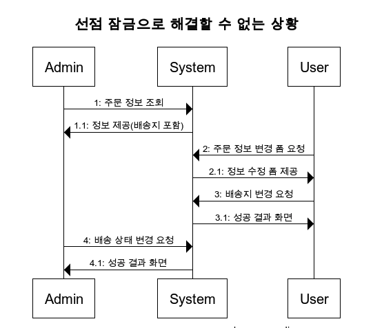

# Chapter01. 도메인 모델 시작하기

코드 링크: https://github.com/madvirus/ddd-start2

### 도메인

- 소프트웨어로 해결하고자 하는 문제 영역을 **`도메인`** 이라고 한다.
- 도메인은 다수의 하위 도메인으로 구성된다. 같은 용어라도 하위 도메인마다 의미가 달라질 수 있다.
- 도메인에 따라 용어 의미가 결정되므로 여러 하위 도메인을 하나의 다이어그램에 모델링하면 안 된다.
- **모델의 각 구성요소는 특정 도메인으로 한정할 때 의미가 완전해지므로 각 하위 도메인마다 별도로 모델을 만들어야 한다.** 결과적으로 카탈로그 하위 도메인 모델과 배송 하위 도메인 모델을 따로 만들어야 한다.

### 요구사항 중요성


- 요구사항을 제대로 이해하지 못하면 쓸모 없거나 유용함이 떨어지는 시스템을 만들게 된다.
  > **1. 개발자와 전문자가 직접 대화하라.** 제품 개발과 관련된 도메인 전문가, 관계자, 개발자가 같은 지식을 공유하고 직접 소통할수록 도메인 전문가가 원하는 제품을 만들 가능성이 높아진다.
  > **2. 왜 이런 기능을 요구하는지 또는 실제로 원하는 게 무엇인지 생각하고 전문가와 대화를 통해 진짜로 원하는 것을 찾아야 한다.** 전문가나 관련자가 요구한 내용이 항상 올바른 것이 아니며 때론 본인들이 실제로 원하는 것을 정확하게 표현하지 못할 때도 있다.

### 도메인 모델 패턴


- 영역
  - 사용자 인터페이스 또는 표현(Presentation)
  - 응용(Application)
  - 도메인(Domain)
  - 인프라스트럭처(Infrastructure)
- 표현 영역
  - **HTTP 요청**을 응용 영역이 필요로 하는 형식으로 변환해서 응용 영역에 전달하고 응용 영역의 응답을 HTTP 응답으로 변환하여 전송한다.
- 응용 영역
  - **기능을 구현**하기 위해 도메인 영역의 도메인 모델을 사용한다. 응용 서비스는 로직을 직접 수행하기보다는 도메인 모델에 로직 수행을 위임한다. (주문 취소 로직을 직접 구현하지 않고, Order 객체에 취소 처리를 위임한다.)
- 도메인 영역
  - **도메인 모델을 구현**한다. 도메인의 핵심 로직을 담당한다.
- 인프라스트럭처 영역
  - **구현 기술에 대한 것**을 다룬다. RDBMS 연동을 처리하고, 메시징 큐에 메시지를 전송하거나 수신하는 기능을 구현하는 등의 역할을 한다.

#### 개념 모델과 구현 모델

- 개념모델은 순수하게 문제를 분석한 결과물이다. 데이터베이스, 트랜잭션 처리, 성능, 구현 기술과 같은 것을 고려하지 않기에 실제 코드를 작성할 때 개념 모델을 있는 그대로 사용할 수 없다.
- **개념 모델을 구현 가능한 형태의 모델로 전환하는 과정**을 거치게 된다.
- 프로젝트 초기에 개요 수준의 개념 모델로 도메인에 대한 전체 윤곽을 이해하는 데 집중하고, 구현하는 과정에서 개념 모델을 구현 모델로 점진적으로 발전시켜 나가야 한다.

### 도메인 모델 도출

- 도메인을 모델링할 때 기본이 되는 작업은 모델을 구성하는 핵심 구성요소, 규칙, 기능을 찾는 것이다. 이 과정은 요구사항에서 출발한다.

- 도메인 모델을 설명할 때는 `isShippingChangeable`라는 이름으로 제약 조건을 검사했는데 지금은 `verifyNotYetShipped`라는 이름으로 변경했다. 이름이 바뀐 이유는 그 사이에 도메인을 더 잘 알게 되었기 때문이다. 요구사항을 분석하면서 **배송지 정보 변경과 주문 취소가 둘 다 `출고 전에 가능하다`는 제약이 있음**을 알게 된 것이다.

#### 문서화

- 전반적인 기능 목록이나 모듈 구조, 빌드 과정은 코드를 보고 직접 이해하는 것보다 상위 수준에서 정리한 문서를 참조하는 것이 소프트웨어 전반을 빠르게 이해하는 데 도움이 된다.
- 도메인 관점에서 코드가 도메인을 잘 표현해야 코드의 가독성이 높아지고 문서로서 코드가 의미를 갖는다.

### 엔티티와 벨류

- 도출한 모델은 크게 엔티티와 벨류로 구분할 수 있다.

#### 엔티티

- 식별자를 가진다.
- 식별자는 엔티티 객체마다 고유해서 각 엔티티는 서로 다른 식별자를 갖는다.
- 엔티티의 식별자는 고유하기에 두 엔티티 객체의 식별자가 같으면 두 엔티티는 같다고 판단할 수 있다.

#### 엔티티 식별자 생성

- 특정 규칙에 따라 생성
- UUID나 Nano ID와 같은 고유 식별자 생성기 사용
- 값을 직접 입력
- 일련번호 사용(시퀀스나 DB의 자동 증가 컬럼 사용)

#### 벨류 타입

- 밸류 타입은 개념적으로 완전한 하나를 표현할 때 사용한다.
- 밸류 객체의 데이터를 변경할 때는 기존 데이터를 변경하기보다는 변경한 데이터를 갖는 새로운 밸류 객체를 생성하는 방식을 선호한다. 이러한 불변 객체는 참조 투명성과 스레드에 안전한 특징을 갖고 있다.
- **도메인 모델에 Set 메서드를 넣지 말아라.** 도메인의 핵심 개념이나 의도를 코드에서 사라지게 한다. 또 다른 문제는 도메인 객체를 생성할 때 온전하지 않은 상태가 될 수 있다.

### 도메인 용어와 유비쿼터스 언어

- 에릭 에반스는 도메인 주도 설계에서 언어의 중요함을 강조하기 위해 유비쿼터스 언어(ubiquitous language)라는 용어를 사용했다. 전문가, 관계자, 개발자가 도메인과 관련된 공통의 언어를 만들고 이를 대화, 문서, 도메인 모델, 코드, 테스트 등 모든 곳에서 같은 용어를 사용한다.
- 이를 통해 소통 과정에서 발생하는 용어의 모호함을 줄이고 개발자는 도메인과 코드 사이에서 불필요한 해석 과정을 줄일 수 있다.
- **알맞은 영단어를 찾는 것은 쉽지 않은 일이지만 시간을 들여 찾는 노력을 해야 한다.** 도메인에 어울리지 않는 단어를 사용하면 코드는 도메인과 점점 멀어지게 된다.

# Chapter02. 아키텍처 개요

### 계층 구조 아키텍처


- 계층 구조는 그 특성상 상위 계층에서 하위 계층으로의 의존만 존재하고 하위 계층은 상위 계층에 의존하지 않는다.
- 구현의 편리함을 위해 계층 구조를 유연하게 적용하기도 한다. 예를 들어 응용 계층은 바로 아래 계층인 도메인 계층에 의존하지만 외부 시스템과의 연동을 위해 더 아래 계층인 인프라스트럭처 계층에 의존하기도 한다.
- 응용 영역과 도메인 영역은 DB나 외부 시스템 연동을 위해 인프라스터럭처의 기능을 사용하므로 이런 계층 구조를 사용하는 것은 직관적으로 이해하기 쉽다. 하지만 **짚고 넘어가야 할 점은 표현, 응용, 도메인 계층이 상세한 기술을 다루는 인프라스트럭처 계층에 종속된다.**

### DIP

- 고수준 모듈이 제대로 동작하려면 저수준 모듈을 사용해야 한다. 그런데 고수준 모듈이 저수준 모듈을 사용하면 두 가지 문제인 구현 변경과 테스트가 어렵다는 문제가 발생한다.
- DIP를 적용하면 저수준 모듈이 고수준 모듈에 의존하게 된다. (Dependency Inversion Principle)
- DIP 핵심은 고수준 모듈이 조수준 모듈에 의존하지 않도록 하기 위함이다. DIP를 적용한 결과 구조만 보고 저수문 모듈에서 인터페이스를 추출하지 않도록 해라.


- **도메인 영역에 영향을 최소화하면서 구현체(인프라스트럭처)를 변경하거나 추가할 수 있다.**

### 도메인 영역 주요 구성요소

#### 엔티티(ENTITY)

- 고유의 식별자를 갖는 객체로 자신의 라이프 사이클을 갖는다.
- 주문, 회원, 상품과 같이 도메인의 고유한 개념을 표현한다.
- 도메인 모델의 데이터를 포함하며 해당 데이터와 관련된 기능을 함께 제공한다.

#### 밸류(VALUE)

- 고유의 식별자를 갖지 않는 객체로 주로 개념적으로 하나인 값을 표현할 때 사용된다.
- 배송지 주소를 표현하기 위해 주소(Address)나 구매 금액을 위한 금액(Money)와 같은 타입이 밸류 타입이다.
- 엔티티의 속성으로 사용할 뿐만 아니라 다른 밸류 타입의 속성으로도 사용할 수 있다.

#### 애그리거트(AGGREGATE)

- 연관된 엔티티와 밸류 객체를 개념적으로 하나로 묶은 것이다. 예를 들어 주문과 관련된 Order 엔티티, OrderLine 밸류, Orderer 밸류 객체를 '주문' 애그리거트로 묶을 수 있다.

#### 리포티터리(REPOSITORY)

- 도메인 모델의 영속성을 처리한다.

#### 도메인 서비스(DOMAIN SERVICE)

- 특정 엔티티에 속하지 않은 도메인 로직을 제공한다. '할인 금액 계산'은 상품, 쿠폰, 회원 등급, 구매 금액 등 다양한 조건을 이용해서 구현하게 되는데, 이렇게 도메인 로직이 여러 엔티티와 밸류를 필요로 하면 도메인 서비스에서 로직을 구현한다.

### 인프라스트럭처 개요

- 인프라스트럭처는 표현 영역, 응용 영역, 도메인 영역을 지원한다. 도메인 객체의 영속성 처리, 트랜잭션, SMTP 클라이언트, REST 클라이언트 등 다른 영역에서 필요로 하는 프레임워크, 구현 기술, 보조 기능을 지원한다.
- **도메인 영역과 응용 영역에서 인프라스트럭처의 기능을 직접 사용하는 것보다 이 두 영역에 정의한 인터페이스를 인프라스트럭처 영역에서 구현하는 것이 시스템을 더 유연하고 테스트하기 쉽게 만들어준다**.
- 무조건 인프라스트럭처에 대한 의존을 없앨 필요 없다. 예를 들어 스프링을 사용할 경우 응용 서비스에서 트랜잭션 처리를 위해 스프링이 제공하는 @Transactional을 사용하는 것이 편리하다. 영속성 또한 @Entity나 @Table같은 JPA 애너테이션을 도메인 모델 클래스에 사용하는 것이 XML 매핑 설정을 이용하는 것보다 편리하다.
- 구현의 편리함은 DIP 주는 다른 장점(변경의 유연함, 테스트가 쉬움)만큼 중요하기에 DIP의 장점을 해치지 않는 범위에서 응용 영역과 도메인 영역에서 구현 기술에 대한 의존을 가져가는 것이 나쁘지 않다고 생각한다. **응용 영역과 도메인 영역이 인프라스트럭처에 대한 의존을 완전히 갖지 않도록 시도하는 것은 자칫 구현을 더 복잡하고 어렵게 만들 수 있다.**
  트

# Chapter03. 애그리거트

### 애그리거트

- 백 개 이상의 테이블을 한 장의 ERD에 모두 표시하면 개별 테이블 간 관계를 파악하느라 큰 틀에서 데이터 구조를 이해하는 데 어려움을 겪게 되는 것처럼, 도메인 객체 모델이 복잡해지면 개별 구성요소 위주로 모델을 이해하게 되고 전반적인 구조나 큰 수준에서 도메인 간의 관계를 파악하기 어려워진다.
- **복잡한 도메인을 이해하고 관리하기 쉬운 단위로 만들려면 상위 수준에서 모델을 조망할 수 있는 방법**이 필요하다. 이를 애그리거트라고 한다.
- 도메인 규칙에 따라 최소 주문 시점에 일부 객체를 만들 필요가 없는 경우도 있지만 애그리거트가 속한 구성요소는 대부분 함께 생성하고 함께 제거한다.
- **애그리거트는 경계를 갖는다. 한 애그리거트에 속한 객체는 다른 애그리거트에 속하지 않는다.** 각 애그리거트는 자기 자신을 관리할 뿐 다른 애그리거트를 관리하지 않는다.
- **경계를 설정할 때 기본이 되는 것은 도메인 규칙과 요구사항이다.** 도메인 규칙에 따라 함께 생성되는 구성요소는 한 애그리거트에 속할 가능성이 높다.
- 흔히 'A가 B를 갖는다'로 해석할 수 있는 요구사항이 있다고 하더라도 이것이 반드시 A와 B가 한 애그리거트에 속한다는 것을 의미하는 것은 아니다. 예를 들어 상품과 리뷰를 살펴보면 상품 상세 정보와 함께 리뷰 내용을 보여줘야 한다는 요구사항이 있을 때 한 애그리거트에 속한다고 생각할 수 있다. 하지만, 상품과 리뷰는 함께 생성되지 않고, 함께 변경되지도 않는다.

### 애그리거트 루트

- 애그리거트에 속한 모든 객체가 일관된 상태를 유지하려면 애그리거트 전체를 관리할 주체가 필요하다. 이 책임을 지는 것이 바로 애그리거트의 루트 엔티티이다.
- 불필요한 중복을 피하고 애그리거트 루트를 통해선만 도메인 로직을 구현하게 만들려면 도메인 모델에 다음 두가지를 습관적으로 적용해야 한다.
  1. 단순히 필드를 변경하는 set 메서드를 공개 범위로 만들지 않는다.
  2. 밸류 타입은 불변으로 구현한다.

#### 트랜잭션

- 한 트랜잭션에는 한 개의 애그리거트만 수정해야 한다. 한 트랜잭션에서 두 개 이상의 애그리거트를 수정하면 충돌이 발생할 가능성이 더 높아지기에 한 번에 수정하는 애그리거트 개수가 많아질수록 전체 처리량은 감소한다.
- 다음의 경우에는 한 트랜잭션에서 두 개 이상의 애그리거트를 변경하는 것을 고려할 수 있다.
  1. 팀 표준: 팀이나 조직의 표준에 따라 사용자 유스케이스와 관련된 응용 서비스의 기능은 한 트랜잭션으로 실행해야 하는 경우가 있다.
  2. 기술 제약: 기술적으로 이벤트 방식을 도입할 수 없는 경우 한 트랜잭션에서 다수의 애그리거트를 수정해서 일관성을 처리해야 한다.
  3. UI 구현의 편리: 운영자의 편리함을 위해 주문 목록 화면에서 여러 주문의 상태를 한 번에 변경하고 싶을 것이다. 이 경우 한 트랜잭션에서 여러 주문 애그리거트의 상태를 변경해야 한다.

### ID를 이용한 애그리거트 참조

- ORM 기술 덕에 애그리거트 루트에 대한 참조를 쉽게 구현할 수 있고 필드를 이용한 애그리거트 참조를 이용하면 다른 애그리거트의 데이터를 쉽게 조회할 수 있다. 하지만 다음의 문제를 야기할 수 있다.
  1. 편한 탐색 오용: 다른 애그리거트 상태 쉽게 변경
  2. 성능에 대한 고민: JPA를 사용할 때 지연 로딩과 즉시 로딩의 다양한 경우의 수 고려
  3. 확장: 부하 분산을 위해 하위 도메인별로 시스템을 분리할 때 하위 도메인 별 다른 DBMS를 사용할 때가 있음. JPA와 같은 단일 기술의 한계.
- **ID 참조**를 사용하면 모든 객체가 참조로 연결되지 않고 한 애그리거트에 속한 개체들만 참조로 연결된다. 이는 **애그리거트의 경계를 명확히 하고 애그리거트 간 물리적인 연결을 제거하기 때문에 모델의 복잡도를 낮춘다**. 또한 **애그리거트 간 의존을 제거하므로 응집도를 높여주는 효과** 도 있다.
- **ID 참조 방식을 사용하면서 N+1 조회와 같은 문제가 발생하지 않도록 하려면 조회 전용 쿼리를 사용**한다. 별도의 DAO를 만들고 DAO의 조회 메서드에 조인을 이용해 한 번의 쿼리로 필요한 데이터를 로딩한다.

### 애그리거트 간 집합 연관

- 카테고리에 속한 모든 Product를 조회. 개념적으로 애그리거트 간 1-N 연관이 있더라도 이런 성능 문제 때문에 애그리거트 간의 1-N 연관을 실제 구현에 반영하지 않는다.
- 보통 특정 카테고리에 속한 상품 목록을 보여줄 때 목록 화면에서 각 상품이 속한 모든 카테고리를 상품 정보에 표시하지 않는다. 제품이 속한 카테고리가 필요한 화면은 상품 상세 화면이다. 이러한 요구사항을 고려할 때 상품으로의 집합 연관은 필요로 하지 않다. 상품에서 카테고리로의 집합 연관만 존재하면 된다.

### 애그리거트를 팩토리로 사용하기

- Store가 Product를 생성할 수 있는지 판단하고 Product를 생성하는 것은 논리적으로 하나의 도메인 기능인데 이 도메인 기능을 응용 서비스에서 구현하는 문제가 있다.
- 이를 도메인으로 분리하여 구현하면 도메인 로직이 변경해도 응용 서비스는 영향을 받지 않는다. 도메인의 응집도는 올라간다.

# Chapter04. 리포지터리와 모델 구현
### @SecondaryTable와 @AttributeOverrides
- 값 객체를 분리하여 도메인 모델의 명확성을 높인다.
  1. 역할과 책임 분리: Article 엔티티는 게시글의 식별자, 제목 등의 기본 정보를 담당하는 반면, ArticleContent 값 객체는 게시글의 내용과 관련된 세부 정보(본문 내용, 내용 유형 등)를 관리
  2. 불변성 보장: 값 객체는 불변성을 가지는 특성을 가진다. ArticleContent가 값 객체로 설계된 경우, 한 번 생성된 후에는 그 상태가 변경되지 않는다. 이러한 불변성은 복잡한 도메인 로직에서 데이터의 안정성과 예측 가능성을 보장
  3. 도메인의 의도 표현: 값 객체를 사용함으로써 도메인의 의도를 코드 수준에서 명시적으로 표현
```java
@Entity
@Table(name = "article")
@SecondaryTable(
    name = "article_content",
    pkJoinColumns = @PrimaryKeyJoinColumn(name = "id")
)
@Getter
public class Article {
  @Id
  @GeneratedValue
  private Long id;

  private String title;

  @AttributeOverrides({
    @AttributeOverride(
        name = "content",
        column = @Column(table = "article_content", name = "content")),
    @AttributeOverride(
        name = "contentType",
        column = @Column(table = "article_content", name = "content_type"))
  })
  @Embedded
  private ArticleContent content;
}
```
```java
@Embeddable
@Access(AccessType.FIELD)
@Getter
public class ArticleContent {
  private String content;
  private String contentType;
}
```
- **@SecondaryTable을 사용하면, Article 엔티티의 주요 키를 ArticleContent 테이블의 외래 키로 활용**
- 고려할 사항
  1. 조회 성능: @SecondaryTable을 사용하면 추가로 조인 작업이 필요
  2. 복잡성 증가: 데이터 모델이 더 복잡해지고, 디버깅과 유지보수가 어려워질 수 있음
  3. ORM 특성에 의존: 모든 JPA 구현체에서 @SecondaryTable의 세밀한 동작이 일관되지 않을 수 있음

### Integer VS Money
- Money를 사용한다면 도메인을 좀 더 명확하게 표현할 수 있다.
- Money도메인에서 금액의 유효성 검사나 금액 변환, 연산 등의 연산을 구현하여 코드의 중복을 제거할 수 있다.
- 그렇다면, Money를 데이터베이스에 저장할 때 어떻게 할 수 있을까?
> converter를 이용한다. 두 개 이상의 프로퍼티를 가진 밸류 타입을 한 개의 컬럼에 매핑할 수 있다!

```java
public interface AttributeConverter<X, Y> {
  Y convertToDatabaseColumn(X var1);

  X convertToEntityAttribute(Y var1);
}
```
- 타입 파라미터 X는 밸류 타입이고, Y는 DB 타입이다. 
- convertToDatabaseColumn()는 밸류 타입을 DB 칼럼 값으로 변환하는 기능을 구현하고 convertToEntityAttribute()는 DB 칼럼 값을 밸류로 변환하는 기능을 구현한다.   
```java
@Convert(converter = MoneyConverter.class)
```
- @Converter의 autoApply 속성을 false로 지정하면 프로퍼티 값을 변호나할 때 사용할 컨버터를 직접 적용해야 한다. (기본값: false)

```java
// Product
@Entity
@Table(name = "product")
public class Product {
  @Convert(converter = MoneyConverter.class)
  private Money price;
  ...
}

// Money
public class Money {
  private int value;

  public Money(int value) {
    this.value = value;
  }

  public Money multiply(int multiplier) {
    return new Money(value * multiplier);
  }
  ...
}
     
// MoneyConverter
@Converter(autoApply = true)
public class MoneyConverter implements AttributeConverter<Money, Integer> {

  @Override
  public Integer convertToDatabaseColumn(Money money) {
    return money == null ? null : money.getValue();
  }

  @Override
  public Money convertToEntityAttribute(Integer value) {
    return value == null ? null : new Money(value);
  }
}
```

### 밸류 컬렉션을 별도의 테이블로 매핑(@ElementCollection)
```java
@ElementCollection(fetch = FetchType.LAZY)
@CollectionTable(name = "order_line", 
  joinColumns = @JoinColumn(name = "order_number"))
@OrderColumn(name = "line_idx")
private List<OrderLine> orderLines;
```
- @OrderColumn을 통해 주문 항목들이 저장될 때 그 순서를 데이터베이스에 함께 저장한다.

### 밸류를 이용한 ID 매핑
- 밸류 타입을 식별자로 매핑하면 @Id 대신 @EmbeddedId 애너테이션을 사용한다.
- JPA에서 식별자 타입은 Serializable 타입이어야 하므로 식별자를 사용할 밸류 타입은 Serializable 인터페이스를 상속받아야 한다.
- 밸류 타입으로 식별자를 구현할 때 얻을 수 있는 장점은 식별자에 기능을 추가할 수 있다.
  - 1세대 2세대 시스템의 주문번호를 구분할 때 주문번호의 첫 글자를 이용할 경우 밸류 클래스에 시스템 세대를 구분할 수 있는 기능 추가할 수 있다.

### 밸류 컬렉션을 @Entity로 매핑
- 개념적으로 밸류인데 구현 기술의 한계나 팀 표준으로 @Entity를 사용해야 할 때가 있다.
- JPA는 @Embeddable 타입의 클래스 상속 매핑을 지원하지 않는다. 상속 구조를 갖는 밸류 타입을 사용하려면 @Embeddable 대신 @Entity를 사용해서 상속 매핑으로 처리해야 한다. 따라서 식별자 매핑을 위한 필드도 추가해야 한다. 또한 구현 클래스를 구분하기 위한 타입 식별(discriminator) 컬럼을  추가한다.
```java
@Entity
@Inheritance(strategy = InheritanceType.SINGLE_TABLE)
@DiscriminatorColumn(name = "image_type")
@Table(name = "image")
public abstract class Image {
  @Id
  @GeneratedValue(strategy = GenerationType.IDENTITY)
  @Column(name = "image_id")
  private Long id;
  ...
}

@Entity
@DiscriminatorValue("EI")
public class ExternalImage extends Image {}

@Entity
@DiscriminatorValue("II")
public class InternalImage extends Image {}
```                
- Image가 @Entity이므로 목록을 담고 있는 Product는 @OneToMany를 이용해서 매핑을 처리한다.
- Image는 밸류이므로 독자적인 라이플 사이클을 갖지 않고 Product에 완전히 의존한다.
```java
@Entity
@Table(name = "product")
public class Product {
  ...
  @OneToMany(cascade = {CascadeType.PERSIST, CascadeType.REMOVE}, 
    orphanRemoval = true, fetch = FetchType.LAZY)
  @JoinColumn(name = "product_id")
  @OrderColumn(name = "list_idx")
  private List<Image> images = new ArrayList<>();
}
public void changeImages(List<Image> newImages) {
  images.clear();
  images.addAll(newImages);
}
```
- 이미지 교체를 위해 clear()를 사용한다. @Entity에 대한 @OneToMany 매핑에서 컬렉션의 clear() 메서드를 호출하면 삭제 과정이 효율적이지 않다.
  - 하이버네이트의 경우 @Entity를 위한 컬렉션 객체의 clear() 메서드를 호출하면 select 쿼리로 대상 엔티티를 로딩하고, 각 개별 엔티티에 대해 delete 쿼리를 실행한다.
  - 하이버네이트의 경우 @Embeddable 타입에 대한 컬렉션 clear() 호출하면 객체를 로딩하지 않고 한 번의 delete 쿼리로 삭제 처리를 수행한다. 따라서 애그리거트의 특성을 유지하면서 이 문제를 해소하려면 결국 상속을 포기하고 @Embeddable로 매핑된 단일 클래스로 구현해야 한다.

### ID참조와 조인 테이블을 이용한 단방향 M:N 매핑
- 애그리거트 간 집합 연관은 성능 상의 이유로 피해야 한다. 하지만, 요구사항을 만족하는 데 집합 연관을 사용하는 게 유리하다면 ID 참조를 이용한 단방향 집합 연관을 적용해볼 수 있다.
```java
@Entity
@Table(name = "product")
public class Product {
@EmbeddedId
private ProductId id;

@ElementCollection(fetch = FetchType.LAZY)
@CollectionTable(name = "product_category",
        joinColumns = @JoinColumn(name = "product_id"))
private Set<CategoryId> categoryIds;
```
- Product에서 Category 로의 단방향 M-N 연관을 ID 참조 방식으로 구현한 것이다.
- ID 참조를 이용한 애그리거트 간 단방향 M-N 연관은 밸류 컬렉션 매핑과 동일한 방식으로 설정한 것을 알 수 있다. 차이점이 있다면 집합의 값에 밸류 대신 연관을 맺는 식별자가 온다는 점이다.
- @ElementCollection을 이용하기에 Product를 삭제할 때 매핑에 사용한 조인 테이블의 데이터도 함께 삭제된다. 애그리거트를 직접 참조하는 방식을 사용했다면 영속성 전파나 로딩 전략을 고민해야 한다.

### 애그리거트 로딩 전략
- 즉시 로딩 방식으로 설정하면 애그리거트 루트를 로딩하는 시점에 애그리거트에 속한 모든 객체를 함께 로딩할 수 있는 장점이 있다.
- 연관된 테이블을 조인한 쿼리를 가져올 때 카타시안 조인을 사용하기에 중복이 발생한다. 물론 하이버네이트가 중복을 제거해서 실제 메모리에는 알맞게 데이터가 있겠지만 조회된 데이터가 많아지면 성능을 고려해야 한다.
- 애그리거트는 개념적으로 하나여야 하고, 루트 엔티티를 로딩하는 시점에 애그리거트에 속한 객체를 모두 로딩해야 하는 것은 아니다.
- 애그리거트가 완전해야 하는 이유는 크게 두 가지가 있다. 첫째는 상태를 변경하는 기능을 실행할 때 애그리거트 상태가 완전해야하고, 둘째로는 표현 영역에서 애그리거트의 상태 정보를 보여줄 때 필요하기 때문이다. 이 중 두번째는 별도의 조회 전용 기능과 모델을 구현하는 방식을 사용하는 것이 더 유리하기에 애그리거트의 완전 로딩과 관련된 문제는 상태 변경과 더 관련이 있다. ... 게다가 일반적인 애플리케이션은 상태 변경 기능을 싱행하는 빈도보다 조회 기능을 실행하는 빈도가 훨씬 높다. ... **애그리거트 내 모든 연관을 즉시 로딩으로 설정할 필요는 없다.** ... **따라서 무조건 즉시 로딩이나 지연 로딩으로만 설정하기보다는 애그리거트에 맞게 즉시 로딩과 지연 로딩을 선택해야 한다.**

### 식별자 생성 기능
1. 사용자가 직접 생성
2. 도메인 로직으로 생성
3. DB를 이용한 일련번호로 생성
- 식별자 생성 규칙이 있다면 엔티티를 생성할 때 식별자를 엔티티가 별도 서비스로 식별자 생성 기능을 분리해야 한다.
- 식별자 생성 규칙은 도메인 규칙이므로 도메인 영역에 식별자 생성 기능을 위치시켜야 한다.


# Chapter05. 스프링 데이터 JPA를 이용한 조회 기능
- 검색 조건을 다양하게 조합해야 할 때 사용할 수 있는 것이 스펙(Specification)이다. 애그리거트가 특정 조건을 충족하는지를 검사할 때 사용하는 인터페이스다. 스펙 인터페이스는 다음과 같이 정의한다.
```java
public interface Specification<T> {
  public boolean isSatisfiedBy(T agg);
}
```
> 쿼리dsl로 다양한 분기문을 처리하면 검색 조건에 처리할 수 있는데 그럼에도 스펙을 사용할 필요가 있을까?
1. 도메인 중심의 설계 강화: 스펙 패턴은 도메인 모델을 중심으로 조건을 명시하고, 이 조건을 기반으로 객체가 특정 기준을 만족하는지를 확인하는 방식.
2. 재사용성 및 조합성: 스펙을 사용하면, 복잡한 비즈니스 규칙을 작은 스펙 단위로 나누고, 이들을 조합하여 더 복잡한 규칙을 만들 수 있음.
3. 테스트 용이성: 스펙을 독립적인 클래스로 구현함으로써, 각 스펙의 로직을 개별적으로 테스트할 수 있다. 이는 유닛 테스트를 통해 각 비즈니스 규칙을 보다 체계적으로 검증.
- 실제 스펙은 사용하는 기술에 맞춰 구현하게 된다.

### 스프링 데이터 JPA를 이용한 스펙 구현


# Chapter06. 응용 서비스와 표현 영역
- 응용 서비스는 사용자가 요청한 기능을 실행한다. 응용 서비스는 사용자의 요청을 처리하기 위해 리포지터리에서 도메인 객체를 가져와 사용한다.
- 도메인 로직은 도메인 영역에 위치하고 응용 서비스는 도메인 로직을 구현하지 않아야 한다.
  - 분산해서 구현하면 코드의 응집도가 떨어진다.
  - 여러 응용 서비스에서 동일한 도메인 로직을 구현할 가능성이 높아진다.
- 구분되는 기능별로 서비스 클래스를 구현하는 방식은 한 응용 서비스 클래스에서 한 개 내지 2~3개의 기능을 구현한다. (암호 변경 기능 만을 윟나 응용 서비스 클래스를 별도로 구현하는 식)
- 응용 서비스에서 애그리거트 자체를 리턴하면 코딩은 편할 수 있지만 도메인의 로직 실행을 응용 서비스와 표현 영역 두곳에서 할 수 있게 된다. 이는 응집성을 낮추는 원인이 된다. 응용 서비스는 표현 영역에서 필요한 데이터만 반환하도록 한다.
- 응용 서비스의 파라미터 타입을 결정할 때 주의할 점은 표현 영역과 관련된 타입을 사용하면 안된다. 이는 단위테스트를 어렵게 하며, 표현 영역의 구현이 변경되면 응용 서비스의 구현도 함께 변경해야 한다.

### 값 검증
- 값 검증은 표현 영역과 응용 서비스 두 곳에서 모두 할 수 있다. 원칙적으로 모든 값에 대한 검증은 응용 서비스에서 처리한다.
- 표현 영역에서 필수 값과 값의 형식을 검사하면 실질적으로 응용 서비스는 ID 중복 여부와 같은 논리적 오류만 검사하면 된다. 
  - 표현 영역: 필수 값, 값의 형식, 범위 등을 검증한다.
  - 응용 서비스: 데이터의 존재 유무와 같은 논리적 오류를 검증한다.
> 필자는 예전에는 표현 영역에서 필수 값을 검증하고 응용 서비스에서 논리적 오류 검증을 해도 괜찮다고 생각했는데, 요즘은 가능하면 응용 서비스에서 필수 값 검증과 논리적인 검증을 모두 하는 편이다. 응용 서비스에서 필요한 값 모두를 처리하면 프레임워크가 제공하는 검증 기능을 사용할 때보다 작성할 코드가 늘어나는 불편함이 있지만, 응용 서비스의 완성도가 높아지는 이점도 있다. 필자는 이런 이점을 더 크게 느껴 응용 서비스에서 값 오류를 검증하는 편이다.

# Chapter07. 도메인 서비스
- 한 애그리거트에 넣기 애매한 도메인 기능을 억지로 특정 애그리거트에 구현하면 안 된다. 억지로 구현하면 애그리거트는 자신의 책임 범위를 넘어서는 기능을 구현하기에 코드가 길어지고 외부에 대한 의존이 높아져 코드가 복잡해지고 수정하기 어렵게 된다.
- 이런 문제를 해소하는 가장 쉬운 방법이 있는데, **도메인 기능을 별도 서비스로 구현하는 것**이다.
- 도메인 서비스는 도메인 영역에 위치한 도메인 로직을 표현할 때 주로 사용한다. 주로 다음 상황에서 주로 사용한다.
  - 계산 로직: 여러 애그리거트가 필요한 계산 로직이나 한 애그리거트에 넣기에는 다소 복잡한 계산 로직
  - 외부 시스템 연동이 필요한 도메인 로직: 구현하기 위해 타 시스템을 사용해야 하는 도메인 로직
- 할인 금액 규칙 계산처럼 한 애그리거트에 넣기 애매한 도메인 개념을 구현하려면 애그리거트에 억지로 넣기보다는 도메인 서비스를 이용해서 도메인 개념을 명시적으로 드러내면 된다. 응용 영역의 서비스가 응용 로직을 다룬다면 도메인 서비스는 도메인 로직을 다룬다. 
- 도메인 서비스는 상태 없이 로직만 구현한다. 도메인 서비스를 구현하는 데 필요한 상태는 다른 방법으로 전달받는다.
- 할인 계산 서비스를 사용하는 주체는 애그리거트가 될 수도 있고 응용 서비스가 될 수도 있다. 다음과 같이 애그리거트의 결제 금액 계산 기능에 전달하면 사용ㅈ ㅜ체는 애그리거트가 된다.
```java
public class Order {

  public void calculateAomunts(
    DiscountCalculationService disCalSvc, MemberGrade grade) {
      Money totalAmounts = getTotalAmount();
      Money discountAmounts = disCalSvc.calculateDiscountAmounts(this.orderlines, this.coupone, grade);
      this.paymentAmounts = totalAmount.minus(discountAmounts);
    }
    ...
  )
}
```
- **도메인 서비스 객체를 애그리거트에 주입하지 않는다.** 도메인 객체는 필드로 구성된 데이터와 메서드를 이용해서 개념적으로 하나인 모델을 표현한다. 그런데 discountCalculationService 필드는 데이터 자체와는 관련이 없다. 일부 기능만 필요로 하기에 도메인 서비스 객체를 애그리거트에 의존 주입할 이유는 없다.
- 도메인 서비스는 도메인 로직을 수행하지 응용 로직을 수행하지 않는다. 트랜잭션 처리와 같은 로직은 응용 로직이므로 도메인 서비스가 아닌 응용 서비스에서 처리해야 한다.
- 특정 기능이 응용 서비스인지 도메인 서비스인지 감을 잡기 어려울 때는 해당 로직이 **애그리거트의 상태를 변경하거나 애그리거트의 상태 값을 계싼하는지 검사해보면 된다.** 예를 들어 계좌 이체 로직은 계좌 애그리거트의 상태를 변경한다. 결제 금액 로직은 주문 애그리거트의 주문 금액을 계산한다. 이 두 로직은 각각 애그리거트를 변경하고 애그리거트의 값을 계산하는 도메인 로직이다. 도메인 로직이면서 한 애그리거트에 넣기에 적합하지 않으므로 이 두 로직은 도메인 서비스로 구현하게 된다.


# Chapter08. 애그리거트 트랜잭션 관리
### 선점 잠금, 비관적 락(Pessimistic Lock)
- 먼저 애그리거트를 구한 스레드가 애그리거트 사용이 끝날 때까지 다른 스레드가 해당 애그리거트를 수정하지 못하게 막는 방식이다.

#### 선점 잠금으로 해결할 수 없는 상황

- 여기서 문제는 운영자가 배송지 정보를 조회하고 배송 상태로 변경하는 사이에 고객이 배송지를 변경한다는 것이다. 이 문제는 선점 잠금 방식으로 해결할 수 없다. 이때 필요한 것이 비선점 잠금이다. 

### 비선점 잠금, 낙관적 락(Optimistic Lock)
- **비선점 작금은 동시에 접근하는 것을 막는 대신 변경한 데이터를 실제 DBMS에 반영하는 시점에 변경 가능 여부를 확인하는 방식이다.**
- 비선점 잠금을 구현하려면 애그리거트에 버전으로 사용할 숫자 타입 프로퍼티를 추가해야 한다. 애그리거트를 수정할 때마다 버전으로 사용할 버전 값이 1씩 증가한다.
- 수정할 애그리거트와 매핑되는 테이블 버전 값이 현재 애그리거트의 버전과 동일한 경우에만 데이터를 수정한다. 그리고 수정에 성공하면 버전 값을 1증가시킨다. 다른 트랜잭션이 먼저 데이터를 수정해서 버전 값이 바뀌면 데이터 수정에 실패하게 된다.

### 강제 버전 증가
- 애그리거트에 애그리거트 루트 외에 다른 엔티티가 존재하고 기능 실행 도중 루트가 아닌 다른 엔티티의 값만 변경된다고 하자. 이 경우 JPA는 루트 엔티티의 버전 값을 증가시키지 않는다. 연관된 엔티티의 값이 변경된다고 해도 루트 엔티티 자체의 값은 바뀌는 것이 없으므로 루트 엔티티의 버전 값은 갱신하지 않는 것이다.
- **어떤 애그리거트 내 어떤 구성요소의 상태가 바뀌면 로트 애그리거트의 버전 값이 증가해야 비선점 잠금이 올바르게 동작한다.** JPA는 이런 문제를 처리할 수 있도록 EntitiyManager#find() 메서드로 엔티티를 구할 때 강제로 버전 값을 증가시키는 잠금 모드를 지원한다.

### 오프라인 선점 잠금
- 문서를 편집할 때 누군가 먼저 편집을 하는 중이면 다른 사용자가 문서를 수정하고 있다는 안내 문구를 보여준다.

# Chapter09. 도메인 모델과 바운디드 컨텍스트
- 하위 도메인마다 사용하는 용어가 다르기에 올바른 도메인 모델을 개발하려면 하위 도메인마다 모델을 만들어야 한다. 각 모델은 명시적으로 구분되는 경계를 가져서 섞이지 않도록 한다. 여러 하위 도메인 모델이 섞이면 모델의 의미가 약해질 뿐 아니라 여러 도메인 모델이 서로 얽히기 때문에 각 하위 도메인별로 다르게 발전하는 요구사항을 반영하기 어려워진다.
- 모델은 특정한 컨텍스트 아래에서 완전한 의미를 갖는다. 이렇게 구분되는 경계를 갖는 컨텍스트를 DDD에서는 바운디드 컨텍스트라고 부른다.
- 이상적으로 하위 도메인과 바운디드 컨텍스트가 일대일 관계를 가지면 좋겠지만 현실은 그렇지 않을 때가 많다. 바운디드 컨텍스트는 기업의 팀 조직 구조에 따라 결정되기도 한다.
- 용어를 명확하게 구분하지 못해 두 하위 도메인을 하나의 바운디드 컨텍스트에서 구현하기도 한다. 예를 들어 카탈로그와 재고 관리가 아직 명확하게 구분되지 않은 경우 두 하위 도메인을 하나의 바운디드 컨텍스트에서 구현하기도 한다. 
- 여러 하위 도메인을 하나의 바운디드 컨텍스트에서 개발할 때 주의할 점은 하위 도메인의 모델이 섞이지 않도록 하는 것이다. 한 프로젝트에 각 하위 도메인의 모델이 위치하면 아무래도 전체 하위 도메인을 위한 단일 모델을 만들고 싶은 유혹에 빠질 수 있다. 이런 유혹에 걸려들면 **결과적으로 도메인 모델이 개별 하위 도메인을 제대로 반영하지 못해서 하위 도메인별로 기능을 확장하기 어렵게 되고 이는 서비스 경쟁력을 떨어뜨리는 원인**이 된다.
- 한 개의 바운디드 컨텍스트가 여러 하위 도메인을 포함하더라도 하위 도메인마다 구분되는 패키지를 갖도록 구현해야 하며, 이렇게 함으로써 하위 도메인을 위한 모델이 서로 뒤섞이지 않고 하위 도메인마다 바운디드 컨텍스트를 갖는 효과를 낼 수 있다.
- 바운디드 컨텍스트가 도메인 모델만 포함하는 것은 아니다. **도메인 기능을 사용자에게 제공하는 데 필요한 표현 영역, 응용 서비스, 인프라스트럭처 영역을 모두 포함한다.** 도메인 모델의 데이터구조가 바뀌면 DB 테이블 스키마도 함께 변경해야 하므로 테이블도 바운디드 컨텍스트에 포함된다.
- 모든 바운디드 컨텍스트를 반드시 도메인 주도로 개발할 필요는 없다. 상품의 리뷰는 복잡한 도메인 로직을 갖지 안힉에 CRUD 방식으로 구현해도 된다. 즉 DAO와 데이터 중심의 밸류 객체를 이용해 리뷰 기능을 구현해도 유지보수 하는데 큰 문제가 없다. 
- **서비스-DAO 구조를 사용하면 도메인 기능이 서비스에 흩어지게 되지만 도메인 기능 자체가 단순하면 서비스-DAO로 구성된 CRUD 방식을 사용해도 코드를 유지 보수하는데 문제가 되지 않는다고 생각**한다.
- 한 바운디드 컨텍스트에서 두 방식을 혼합해서 사용할 수도 있다. 대표적인 예가 CQRS(Command Query Responsibility Segregation)이다. 상태를 변경하는 명령 기능과 내용을 조회하는 쿼리 기능을 위한 모델을 구분하는 패턴이다.
- 각 바운디드 컨텍스트는 서로 다른 구현 기술을 사용할 수도 있다. 웹 MVC는 스프링 MVC를 사용하고 리포지터리 구현 기술로는 JPA 하이버 네이트를 사용하는 바운디드 컨텍스트가 존재할 수 있고, Netty를 이용해서 REST API를 제공하고 마이바티스를 리포지터리 구현 기술로 사용하는 바운디드 컨텍스트가 존재할 수 있다.
- 기존 카탈로그 시스템을 개발하던 팀과 별도로 추천 시스템을 담당하는 팀이 생겨 해당 팀들에서 주도적으로 추천 시스템을 만들기로 했다고 가정하자. 두 팀이 관련 바운디드 컨텍스트를 개발하면 자연스럽게 통합이 발생한다. 
  - 사용자가 제품 상세 페이지를 보고 잇을 때 상품과 유사한 상품 목록을 화면에 보여준다.
- 사용자가 카탈로그 바운디드 컨텍스트에 추천 제품 목록을 요청하면 카탈로그 바운디드 컨텍스트는 추천 바운디드 컨텍스트로부터 추천 정보를 가져와 추천 제품 목록을 제공한다. 이때 카탈로그 컨텍스트와 추천 컨텍스트의 도메인 모델은 서로 다르다.
  - 도메인 서비스를 구현한 클래스는 인프라스트럭처 영역에 위치한다. 이 클래스는 외부 시스템과 연동을 처리하고 외부 시스템의 모델과 현재 도메인 모델 간의 변환을 책임진다.

# Chapter10. 이벤트
### 시스템 강 결합 문제
1. 외부 서비스가 정상이 아닐 경우 트랜잭션 처리를 어떻게 해야할까?
2. 환분을 처리하는 외부 시스템의 응답 시간이 길어지면 그만큼 대기 시간도 길어진다. 외부 서비스 성능에 직접적인 영향을 받게 된다.
3. 도메인 객체에 서비스를 전달하면 설계상 문제가 나타난다. (주문 로직과 결제 로직이 섞이는 문제)
> 이러한 강한 결합을 없애는 방법이 있다. 바로 이벤트를 사용하는 것이다.

### 이벤트 구성 요소
- 도메인 모델에 이벤트를 도입하려면 네 개의 구성요소인 이벤트, 이벤트 생성 주체, 이벤트 디스패처, 이벤트 핸들러를 구현해야 한다.
- 도메인 모델에서 이벤트 생성 주체는 엔티티, 밸류, 도메인 서비스와 같은 도메인 객체이다. 도메인 객체는 도메인 로직을 실행해서 상태가 바뀌면 관련 이벤트를 발생시킨다. 
- 이벤트 핸들러는 이벤트 생성 주체가 발생한 이벤트에 반응한다. 이벤트 핸들러는 생성 주체가 발생한 이벤트를 전달받아 이벤트에 담긴 데이터를 이용해서 원하는 기능을 실행한다. 
- 이벤트 생성 주체와 이벤트 핸들러를 연결해 주는 것이 이벤트 디스패처다. 이벤트 생성 주체는 이벤트를 생성해서 디스패처에 이벤트를 전달한다. 이벤트를 전달받은 디스패처는 해당 이벤트를 처리할 수 있는 핸들러에 이벤트를 전달한다. 이벤트 디스패처 구현 방식에 따라 이벤트 생성과 처리를 동기나 비동기로 실행하게 된다.

### 이벤트 용도
- 이벤트는 크게 두가지 용도로 쓰인다. 첫째는 트리거(Trigger)다. 도메인의 상태가 바뀔 때 다른 후처리가 필요하면 후처리를 실행하기 위한 트리거로 이벤트를 사용할 수 있다. 두번째 용도는 서로 다른 시스템 간의 데이터 동기화다. 배송지를 변경하면 외부 배송 서비스에 바뀐 배송지 정보를 전송해야 한다. 

### 이벤트, 핸들러, 디스패처 구현

### 비동기 이벤트 처리

### 이벤트 처리와 DB 트랜잭션 고려


# Chapter11. CQRS

### 단일 모델의 장점과 CQRS