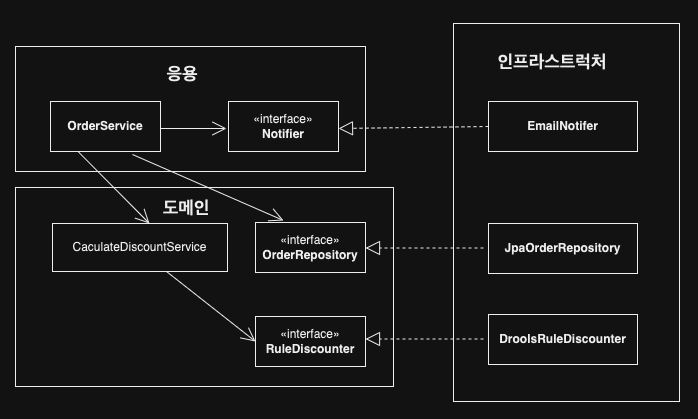

# Chapter01. 도메인 모델 시작하기

코드 링크: https://github.com/madvirus/ddd-start2
기반: 도메인 주도 설계 - 에릭 기반스

### 도메인

- 소프트웨어로 해결하고자 하는 문제 영역을 **`도메인`** 이라고 한다.
- 도메인은 다수의 하위 도메인으로 구성된다. 같은 용어라도 하위 도메인마다 의미가 달라질 수 있다.
- 도메인에 따라 용어 의미가 결정되므로 여러 하위 도메인을 하나의 다이어그램에 모델링하면 안 된다.
- **모델의 각 구성요소는 특정 도메인으로 한정할 때 의미가 완전해지므로 각 하위 도메인마다 별도로 모델을 만들어야 한다.** 결과적으로 카탈로그 하위 도메인 모델과 배송 하위 도메인 모델을 따로 만들어야 한다.

### 요구사항 중요성

- 요구사항을 제대로 이해하지 못하면 쓸모 없거나 유용함이 떨어지는 시스템을 만들게 된다.
  > **1. 개발자와 전문자가 직접 대화하라.** 제품 개발과 관련된 도메인 전문가, 관계자, 개발자가 같은 지식을 공유하고 직접 소통할수록 도메인 전문가가 원하는 제품을 만들 가능성이 높아진다.

> **2. 왜 이런 기능을 요구하는지 또는 실제로 원하는 게 무엇인지 생각하고 전문가와 대화를 통해 진짜로 원하는 것을 찾아야 한다.** 전문가나 관련자가 요구한 내용이 항상 올바른 것이 아니며 때론 본인들이 실제로 원하는 것을 정확하게 표현하지 못할 때도 있다.

### 도메인 모델 패턴

- 영역
  - 사용자 인터페이스 또는 표현(Presentation)
  - 응용(Application)
  - 도메인(Domain)
  - 인프라스트럭처(Infrastructure)
- 표현 영역
  - **HTTP 요청**을 응용 영역이 필요로 하는 형식으로 변환해서 응용 영역에 전달하고 응용 영역의 응답을 HTTP 응답으로 변환하여 전송한다.
- 응용 영역
  - **기능을 구현**하기 위해 도메인 영역의 도메인 모델을 사용한다. 응용 서비스는 로직을 직접 수행하기보다는 도메인 모델에 로직 수행을 위임한다. (주문 취소 로직을 직접 구현하지 않고, Order 객체에 취소 처리를 위임한다.)
- 도메인 영역
  - **도메인 모델을 구현**한다. 도메인의 핵심 로직을 담당한다.
- 인프라스트럭처 영역
  - **구현 기술에 대한 것**을 다룬다. RDBMS 연동을 처리하고, 메시징 큐에 메시지를 전송하거나 수신하는 기능을 구현하는 등의 역할을 한다.

#### 개념 모델과 구현 모델

- 개념모델은 순수하게 문제를 분석한 결과물이다. 데이터베이스, 트랜잭션 처리, 성능, 구현 기술과 같은 것을 고려하지 않기에 실제 코드를 작성할 때 개념 모델을 있는 그대로 사용할 수 없다.
- **개념 모델을 구현 가능한 형태의 모델로 전환하는 과정**을 거치게 된다.
- 프로젝트 초기에 개요 수준의 개념 모델로 도메인에 대한 전체 윤곽을 이해하는 데 집중하고, 구현하는 과정에서 개념 모델을 구현 모델로 점진적으로 발전시켜 나가야 한다.

### 도메인 모델 도출

- 도메인을 모델링할 때 기본이 되는 작업은 모델을 구성하는 핵심 구성요소, 규칙, 기능을 찾는 것이다. 이 과정은 요구사항에서 출발한다.

- 도메인 모델을 설명할 때는 `isShippingChangeable`라는 이름으로 제약 조건을 검사했는데 지금은 `verifyNotYetShipped`라는 이름으로 변경했다. 이름이 바뀐 이유는 그 사이에 도메인을 더 잘 알게 되었기 때문이다. 요구사항을 분석하면서 **배송지 정보 변경과 주문 취소가 둘 다 `출고 전에 가능하다`는 제약이 있음**을 알게 된 것이다.

#### 문서화

- 전반적인 기능 목록이나 모듈 구조, 빌드 과정은 코드를 보고 직접 이해하는 것보다 상위 수준에서 정리한 문서를 참조하는 것이 소프트웨어 전반을 빠르게 이해하는 데 도움이 된다.
- 도메인 관점에서 코드가 도메인을 잘 표현해야 코드의 가독성이 높아지고 문서로서 코드가 의미를 갖는다.

### 엔티티와 벨류

- 도출한 모델은 크게 엔티티와 벨류로 구분할 수 있다.

#### 엔티티

- 식별자를 가진다.
- 식별자는 엔티티 객체마다 고유해서 각 엔티티는 서로 다른 식별자를 갖는다.
- 엔티티의 식별자는 고유하기에 두 엔티티 객체의 식별자가 같으면 두 엔티티는 같다고 판단할 수 있다.

#### 엔티티 식별자 생성

- 특정 규칙에 따라 생성
- UUID나 Nano ID와 같은 고유 식별자 생성기 사용
- 값을 직접 입력
- 일련번호 사용(시퀀스나 DB의 자동 증가 컬럼 사용)

#### 벨류 타입

- 밸류 타입은 개념적으로 완전한 하나를 표현할 때 사용한다.
- 밸류 객체의 데이터를 변경할 때는 기존 데이터를 변경하기보다는 변경한 데이터를 갖는 새로운 밸류 객체를 생성하는 방식을 선호한다. 이러한 불변 객체는 참조 투명성과 스레드에 안전한 특징을 갖고 있다.
- **도메인 모델에 Set 메서드를 넣지 말아라.** 도메인의 핵심 개념이나 의도를 코드에서 사라지게 한다. 또 다른 문제는 도메인 객체를 생성할 때 온전하지 않은 상태가 될 수 있다.

### 도메인 용어와 유비쿼터스 언어

- 에릭 에반스는 도메인 주도 설계에서 언어의 중요함을 강조하기 위해 유비쿼터스 언어(ubiquitous language)라는 용어를 사용했다. 전문가, 관계자, 개발자가 도메인과 관련된 공통의 언어를 만들고 이를 대화, 문서, 도메인 모델, 코드, 테스트 등 모든 곳에서 같은 용어를 사용한다.
- 이를 통해 소통 과정에서 발생하는 용어의 모호함을 줄이고 개발자는 도메인과 코드 사이에서 불필요한 해석 과정을 줄일 수 있다.
- **알맞은 영단어를 찾는 것은 쉽지 않은 일이지만 시간을 들여 찾는 노력을 해야 한다.** 도메인에 어울리지 않는 단어를 사용하면 코드는 도메인과 점점 멀어지게 된다.

# Chapter02. 아키텍처 개요

### 계층 구조 아키텍처

- 계층 구조는 그 특성상 상위 계층에서 하위 계층으로의 의존만 존재하고 하위 계층은 상위 계층에 의존하지 않는다.
- 구현의 편리함을 위해 계층 구조를 유연하게 적용하기도 한다. 예를 들어 응용 계층은 바로 아래 계층인 도메인 계층에 의존하지만 외부 시스템과의 연동을 위해 더 아래 계층인 인프라스트럭처 계층에 의존하기도 한다.
- 응용 영역과 도메인 영역은 DB나 외부 시스템 연동을 위해 인프라스터럭처의 기능을 사용하므로 이런 계층 구조를 사용하는 것은 직관적으로 이해하기 쉽다. 하지만 **짚고 넘어가야 할 점은 표현, 응용, 도메인 계층이 상세한 기술을 다루는 인프라스트럭처 계층에 종속된다.**

### DIP

- 고수준 모듈이 제대로 동작하려면 저수준 모듈을 사용해야 한다. 그런데 고수준 모듈이 저수준 모듈을 사용하면 두 가지 문제인 구현 변경과 테스트가 어렵다는 문제가 발생한다.
- DIP를 적용하면 저수준 모듈이 고수준 모듈에 의존하게 된다. (Dependency Inversion Principle)
- DIP 핵심은 고수준 모듈이 조수준 모듈에 의존하지 않도록 하기 위함이다. DIP를 적용한 결과 구조만 보고 저수문 모듈에서 인터페이스를 추출하지 않도록 해라.

- **도메인 영역에 영향을 최소화하면서 구현체(인프라스트럭처)를 변경하거나 추가할 수 있다.**

### 도메인 영역 주요 구성요소

#### 엔티티(ENTITY)

- 고유의 식별자를 갖는 객체로 자신의 라이프 사이클을 갖는다.
- 주문, 회원, 상품과 같이 도메인의 고유한 개념을 표현한다.
- 도메인 모델의 데이터를 포함하며 해당 데이터와 관련된 기능을 함께 제공한다.

#### 밸류(VALUE)

- 고유의 식별자를 갖지 않는 객체로 주로 개념적으로 하나인 값을 표현할 때 사용된다.
- 배송지 주소를 표현하기 위해 주소(Address)나 구매 금액을 위한 금액(Money)와 같은 타입이 밸류 타입이다.
- 엔티티의 속성으로 사용할 뿐만 아니라 다른 밸류 타입의 속성으로도 사용할 수 있다.

#### 애그리거트(AGGREGATE)

- 연관된 엔티티와 밸류 객체를 개념적으로 하나로 묶은 것이다. 예를 들어 주문과 관련된 Order 엔티티, OrderLine 밸류, Orderer 밸류 객체를 '주문' 애그리거트로 묶을 수 있다.

#### 리포티터리(REPOSITORY)

- 도메인 모델의 영속성을 처리한다.

#### 도메인 서비스(DOMAIN SERVICE)

- 특정 엔티티에 속하지 않은 도메인 로직을 제공한다. '할인 금액 계산'은 상품, 쿠폰, 회원 등급, 구매 금액 등 다양한 조건을 이용해서 구현하게 되는데, 이렇게 도메인 로직이 여러 엔티티와 밸류를 필요로 하면 도메인 서비스에서 로직을 구현한다.

### 인프라스트럭처 개요

- 인프라스트럭처는 표현 영역, 응용 영역, 도메인 영역을 지원한다. 도메인 객체의 영속성 처리, 트랜잭션, SMTP 클라이언트, REST 클라이언트 등 다른 영역에서 필요로 하는 프레임워크, 구현 기술, 보조 기능을 지원한다.
- **도메인 영역과 응용 영역에서 인프라스트럭처의 기능을 직접 사용하는 것보다 이 두 영역에 정의한 인터페이스를 인프라스트럭처 영역에서 구현하는 것이 시스템을 더 유연하고 테스트하기 쉽게 만들어준다**.
- 무조건 인프라스트럭처에 대한 의존을 없앨 필요 없다. 예를 들어 스프링을 사용할 경우 응용 서비스에서 트랜잭션 처리를 위해 스프링이 제공하는 @Transactional을 사용하는 것이 편리하다. 영속성 또한 @Entity나 @Table같은 JPA 애너테이션을 도메인 모델 클래스에 사용하는 것이 XML 매핑 설정을 이용하는 것보다 편리하다.
- 구현의 편리함은 DIP 주는 다른 장점(변경의 유연함, 테스트가 쉬움)만큼 중요하기에 DIP의 장점을 해치지 않는 범위에서 응용 영역과 도메인 영역에서 구현 기술에 대한 의존을 가져가는 것이 나쁘지 않다고 생각한다. **응용 영역과 도메인 영역이 인프라스트럭처에 대한 의존을 완전히 갖지 않도록 시도하는 것은 자칫 구현을 더 복잡하고 어렵게 만들 수 있다.**
  트

# Chapter03. 애그리거트

### 애그리거트

- 백 개 이상의 테이블을 한 장의 ERD에 모두 표시하면 개별 테이블 간 관계를 파악하느라 큰 틀에서 데이터 구조를 이해하는 데 어려움을 겪게 되는 것처럼, 도메인 객체 모델이 복잡해지면 개별 구성요소 위주로 모델을 이해하게 되고 전반적인 구조나 큰 수준에서 도메인 간의 관계를 파악하기 어려워진다.
- **복잡한 도메인을 이해하고 관리하기 쉬운 단위로 만들려면 상위 수준에서 모델을 조망할 수 있는 방법**이 필요하다. 이를 애그리거트라고 한다.
- 도메인 규칙에 따라 최소 주문 시점에 일부 객체를 만들 필요가 없는 경우도 있지만 애그리거트가 속한 구성요소는 대부분 함께 생성하고 함께 제거한다.
- **애그리거트는 경계를 갖는다. 한 애그리거트에 속한 객체는 다른 애그리거트에 속하지 않는다.** 각 애그리거트는 자기 자신을 관리할 뿐 다른 애그리거트를 관리하지 않는다.
- **경계를 설정할 때 기본이 되는 것은 도메인 규칙과 요구사항이다.** 도메인 규칙에 따라 함께 생성되는 구성요소는 한 애그리거트에 속할 가능성이 높다.
- 흔히 'A가 B를 갖는다'로 해석할 수 있는 요구사항이 있다고 하더라도 이것이 반드시 A와 B가 한 애그리거트에 속한다는 것을 의미하는 것은 아니다. 예를 들어 상품과 리뷰를 살펴보면 상품 상세 정보와 함께 리뷰 내용을 보여줘야 한다는 요구사항이 있을 때 한 애그리거트에 속한다고 생각할 수 있다. 하지만, 상품과 리뷰는 함께 생성되지 않고, 함께 변경되지도 않는다.

### 애그리거트 루트

- 애그리거트에 속한 모든 객체가 일관된 상태를 유지하려면 애그리거트 전체를 관리할 주체가 필요하다. 이 책임을 지는 것이 바로 애그리거트의 루트 엔티티이다.
- 불필요한 중복을 피하고 애그리거트 루트를 통해선만 도메인 로직을 구현하게 만들려면 도메인 모델에 다음 두가지를 습관적으로 적용해야 한다.
  1. 단순히 필드를 변경하는 set 메서드를 공개 범위로 만들지 않는다.
  2. 밸류 타입은 불변으로 구현한다.

#### 트랜잭션

- 한 트랜잭션에는 한 개의 애그리거트만 수정해야 한다. 한 트랜잭션엗서 두 개 이상의 애그리거트를 수정하면 충돌이 발생할 가능성이 더 높아지기에 한 번에 수정하는 애그리거트 개수가 많아질수록 전체 처리량은 감소한다.
- 다음의 경우에는 한 트랜잭션에서 두 개 이상의 애그리거트를 변경하는 것을 고려할 수 있다.
  1. 팀 표준: 팀이나 조직의 표준에 따라 사용자 유스케이스와 관련된 응용 서비스의 기능은 한 트랜잭션으로 실행해야 하는 경우가 있다.
  2. 기술 제약: 기술적으로 이벤트 방식을 도입할 수 없는 경우 한 트랜잭션에서 다수의 애그리거트를 수정해서 일관성을 처리해야 한다.
  3. UI 구현의 편리: 운영자의 편리함을 위해 주문 목록 화면에서 여러 주문의 상태를 한 번에 변경하고 싶을 것이다. 이 경우 한 트랜잭션에서 여러 주문 애그리거트의 상태를 변경해야 한다.

### ID를 이용한 애그리거트 참조

- ORM 기술 덕에 애그리거트 루트에 대한 참조를 쉽게 구현할 수 있고 필드를 이용한 애그리거트 참조를 이용하면 다른 애그리거트의 데이터를 쉽게 조회할 수 있다. 하지만 다음의 문제를 야기할 수 있다.
  1. 편한 탐색 오용: 다른 애그리거트 상태 쉽게 변경
  2. 성능에 대한 고민: JPA를 사용할 때 지연 로딩과 즉시 로딩의 다양한 경우의 수 고려
  3. 확장: 부하 분산을 위해 하위 도메인별로 시스템을 분리할 때 하위 도메인 별 다른 DBMS를 사용할 때가 있음. JPA와 같은 단일 기술의 한계.
- **ID 참조**를 사용하면 모든 객체가 참조로 연결되지 않고 한 애그리거트에 속한 개체들만 참조로 연결된다. 이는 **애그리거트의 경계를 명확히 하고 애그리거트 간 물리적인 연결을 제거하기 때문에 모델의 복잡도를 낮춘다**. 또한 **애그리거트 간 의존을 제거하므로 응집도를 높여주는 효과** 도 있다.
- **ID 참조 방식을 사용하면서 N+1 조회와 같은 문제가 발생하지 않도록 하려면 조회 전용 쿼리를 사용**한다. 별도의 DAO를 만들고 DAO의 조회 메서드에 조인을 이용해 한 번의 쿼리로 필요한 데이터를 로딩한다.

### 애그리거트 간 집합 연관

- 카테고리에 속한 모든 Product를 조회. 개념적으로 애그리거트 간 1-N 연관이 있더라도 이런 성능 문제 때문에 애그리거트 간의 1-N 연관을 실제 구현에 반영하지 않는다.
- 보통 특정 카테고리에 속한 상품 목록을 보여줄 때 목록 화면에서 각 상품이 속한 모든 카테고리를 상품 정보에 표시하지 않는다. 제품이 속한 카테고리가 필요한 화면은 상품 상세 화면이다. 이러한 요구사항을 고려할 때 상품으로의 집합 연관은 필요로 하지 않다. 상품에서 카테고리로의 집합 연관만 존재하면 된다.

### 애그리거트를 팩토리로 사용하기

- Store가 Product를 생성할 수 있는지 판단하고 Product를 생성하는 것은 논리적으로 하나의 도메인 기능인데 이 도메인 기능을 응용 서비스에서 구현하는 문제가 있다.
- 이를 도메인으로 분리하여 구현하면 도메인 로직이 변경해도 응용 서비스는 영향을 받지 않는다. 도메인의 응집도는 올라간다.`

# Chapter04. 리포지터리와 모델 구현

# Chapter05. 스프링 데이터 JPA를 이용한 조회 기능

# Chapter06. 응용 서비스와 표현 영역

# Chapter07. 도메인 서비스

# Chapter08. 애그리거트 트랜잭션 관리

# Chapter09. 도메인 모델과 바운디드 컨텍스트

# Chapter10. 이벤트

# Chapter11. CQRS
